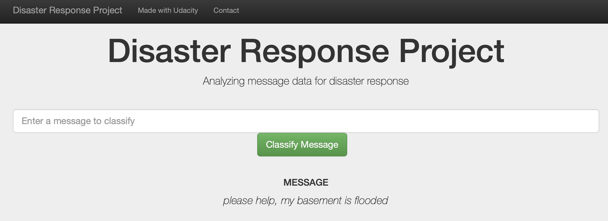
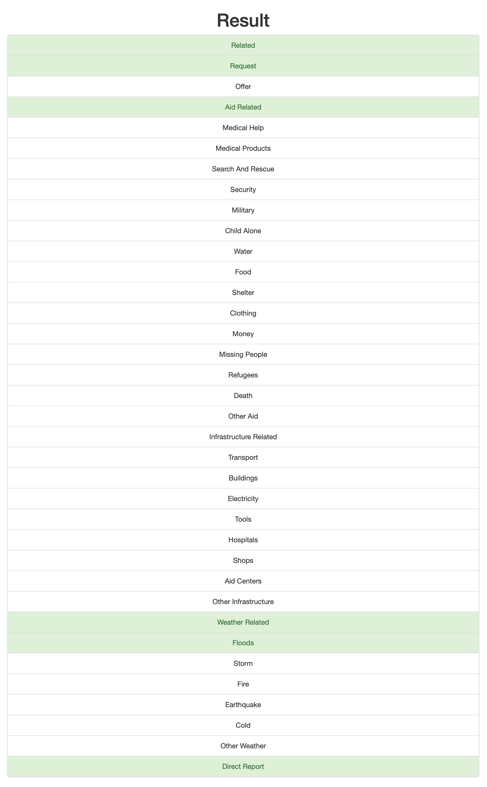
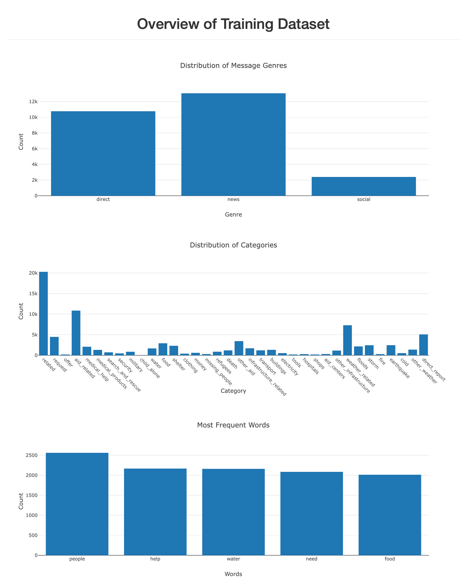

# Disaster Response Pipeline Project

## Table of Contents

1. [Description](#description)
2. [Getting Started](#getting_started)
	1. [Installation](#installation)
	2. [Instructions](#instructions)
3. [Licensing, Authors, and Acknowledgements](#licensing)
4. [Example](#example)

## Description

In this project, I applied some data engineering skills to analyze disaster data from Figure Eight to build a model for an API that classifies disaster messages.

The initial data set contains real messages that were sent during disaster events. The goal of this project was to create a ML pipeline that uses NLP to categorize these events so that these messages could be sent to an appropriate disaster relief agency. This project also includes a web app where someone (like an emergency worker for instance) can input a new message and get classification results in several categories. 

In summary, this project is divided into three sections:

1. ETL Pipeline (process_data.py) that does the following:
    - Loads the messages and categories datasets
    - Merges the two datasets
    - Cleans the data
    - Stores it in a SQLite database
2. ML Pipeline (train_classifier.py) that does the following:
	- Loads data from the SQLite database
	- Splits the dataset into training and test sets
	- Builds a text processing and machine learning pipeline
	- Trains and tunes a model using GridSearchCV
	- Outputs results on the test set
	- Exports the final model as a pickle file
3. Flask Web App (run.py) that shows the classification results in real time. 

## Getting Started

### Installation

* Python 3.*
* SQLlite Database Libraries: SQLalchemy
* Machine Learning Libraries: NumPy, Pandas, SciPy, Sciki-Learn
* Natural Language Process Libraries: NLTK
* Web App and Data Visualization: Flask, Plotly

### Instructions:

1. Run the following commands in the project's root directory to set up your database and model.

    - To run ETL pipeline that cleans data and stores in database
        `python data/process_data.py data/disaster_messages.csv data/disaster_categories.csv data/DisasterResponse.db`
    - To run ML pipeline that trains classifier and saves
        `python models/train_classifier.py data/DisasterResponse.db models/classifier.pkl`

2. Run the following command in the app's directory to run your web app.
    `python run.py`

3. Go to http://0.0.0.0:3001/

## Licensing, Authors, and Acknowledgements

* 
* Author: [Anastasia Atanasoff](https://github.com/atanasoffa)
* Acknowledgements: [Figure Eight](https://www.figure-eight.com/) for providing the disasters dataset to train this model

## Example

Type in this message in the text box: "please help, my basement is flooded"

After clicking on **Classify Message**, you will see the relevant categories related to the input message highlighted in green.

Here are some visuals around the data:

