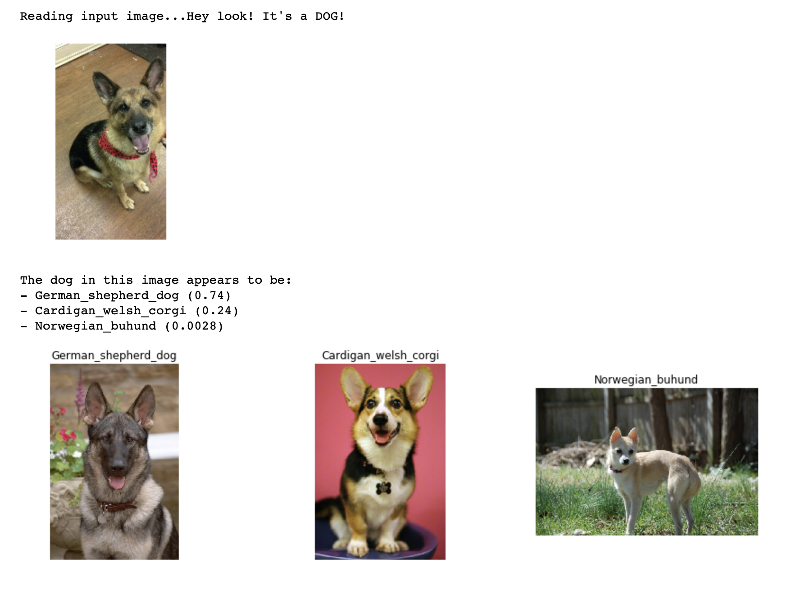
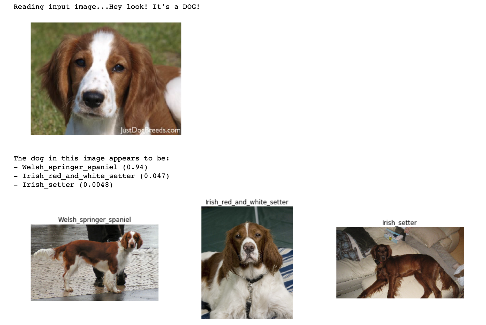
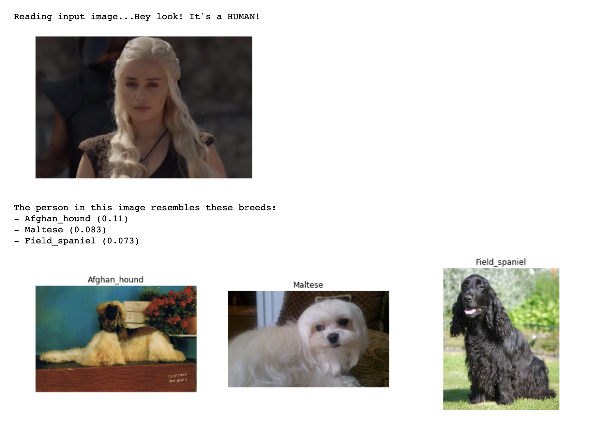
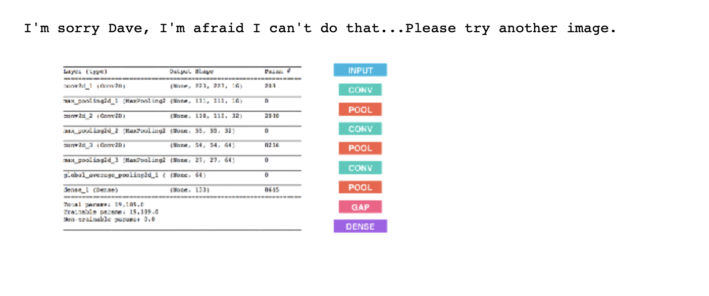

# Dog Breed Classifier Project

## Table of Contents

1. [Project Overview](#overview)
    1. [Summary](#summary)
    2. [Results](#results)
2. [Getting Started](#getting_started)
    1. [Installation](#installation)
    2. [Instructions](#instructions)
3. [Licensing, Authors, and Acknowledgements](#licensing)
4. [Sample Output](#example)

## Project Overview

### Summary 

I developed an image classification algorithm using convolutional neural networks that accepts a file path to an image and does the following:
1. Determines whether the image contains a human, dog, or neither.
2. If a dog is detected in the image, returns the top 3 predicted dog breeds.
3. If a human is detected in the image, returns the top 3 resembling dog breeds.
4. If neither is detected in the image, provides output that indicates an error.

I used transfer learning to create a CNN using bottleneck features from an InceptionV3 model pre-trained on the ImageNet dataset.

The final InceptionV3 model architecture was designed as follows:

-   Input layer: The output of the InceptionV3 model (aka the bottleneck features)
-   Global Average Pooling layer
-   Dropout layer
-   Batch Normalization layer
-   Fully connected layer with a softmax activation function

### Results 

**Human/Dog Detector Results**:

With a test set of 100 human face images and 100 dog images, the following results were determined:

- Human face detector: A human face was detected in 100% of the human images and 11% of the dog images.
- Dog detector: A dog was detected in 0% of the human images and 100% of the dog images.

**Model Results**:

In summary, the pre-trained InceptionV3 model was trained on 6680 dog images using 20 epochs to find the best weights. I then used the trained model to predict the results of 836 test dog images. The result was a test accuracy of 81%.

The performance of this pre-trained model I created was substantially greater than the custom CNN model I built from scratch (please refer to the Jupyter [Notebook]() for details). Where the test accuracy of the InceptionV3 model reached 81%, the CNN model that I built "from scratch" was only around 14%.

## Getting Started

This project is divided into two main parts:

1. Jupyter notebook (dog_app.ipynb)
    - images/ folder contains the test images for this project
    - saved_models/ folder contains the models saved during this project

2. Flask Web App (dog_classifier_app/run.py) that accepts any user-supplied image as input for classification. If a dog is detected in the image, it will provide an estimate of the top dog breed, and if a human is detected, it will provide an estimate of the top resembling dog breed. To view details about this app and how to run it, please go to the `dog_classifier_app` directory).

### Installation

* Python 3.*
* Main Libraries: numpy, pandas, scipy, scikit-learn, keras, tensorflow, tqdm
* Visualization: matplotlib
* Bottleneck features for InceptionV3: (here)[https://s3-us-west-1.amazonaws.com/udacity-aind/dog-project/DogInceptionV3Data.npz]

### Instructions:

Run one of the following commands:

`ipython notebook dog_app.ipynb` or `jupyter notebook dog_app.ipynb`

This will open the iPython Notebook software and project file in your browser.

## Licensing, Authors, and Acknowledgements

* Author: [Anastasia Atanasoff](https://github.com/atanasoffa)
* Acknowledgements: Udacity for the inspiration for this project and for template code for the CNN image classifier.

## Sample Output

Here are screenshots of some of the predicitons from the Jupyter Notebook.

