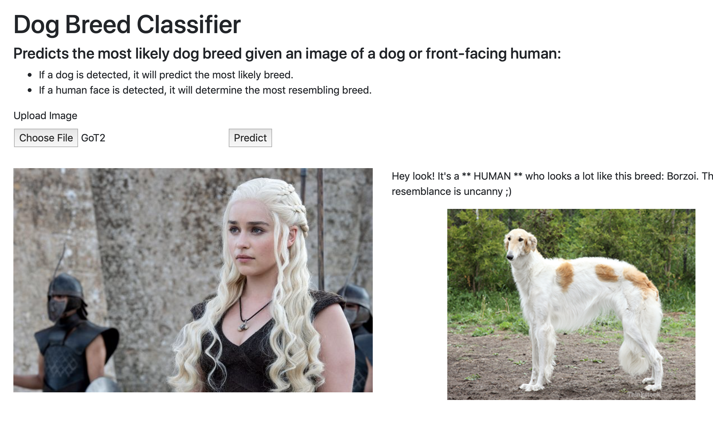
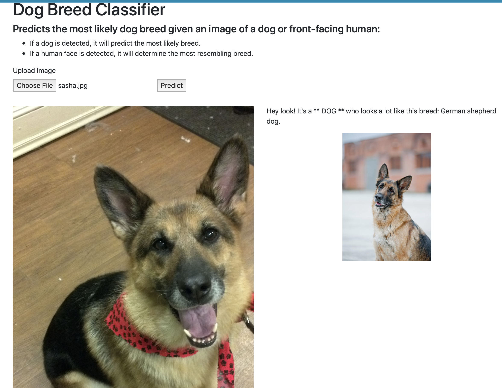
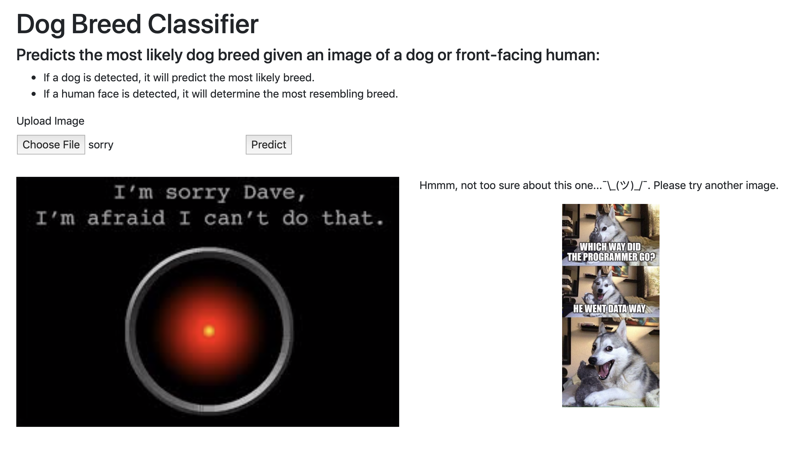

# dog_classifier_app

Web app for predicting dog breeds from an image using a CNN. The Jupyter notebook containing the details and process of the main project is in the root directory of the project.

### Table of Contents

1. [Project Overview](#overview)
2. [File Descriptions](#files)
3. [Installation](#installation)
4. [Licensing, Authors, and Acknowledgements](#licensing)
5. [Example](#example)

## Project Overview 
I developed an image classification algorithm and web app using convolutional neural networks that accepts a user-supplied image as input and does the following:
* If a dog is detected in the image, it returns the top predicted dog breed.
* If a human is detected, it returns the top resembling dog breed.
* If neither is detected, it asks for another image to classify.

## File Descriptions 
This repository includes all of the files that were necessary to code and deploy the web app.

- The templates folder contains HTML/Bootstrap code to design the web page.

- The static folder contains JavaScript/CSS code, the saved Keras model (InceptionV3), as well as a pre-trained face detector file (haarcascade_frontalface_alt.xml) and a pickle file with the list of dog breed names (dog_names.pkl).

- The static/breeds folder contains an image of each dog breed.

- The prediction_scripts folder contains the core code used to classify an image:
	- detector_functions.py: code to detect a human versus dog in an image
	- data_functions.py: helper functions to run the main prediction script
	- predict_dog_breed.py: uses the above two scripts to make breed predictions

The requirements.txt file includes all of the necessary libraries for this project.

And finally, `run.py` is the script to run the actual web app in your browser.

## Installation 
This code runs using Python versions 3.\*. Additional python packages needed for this code are included in the requirements.txt file.

The packages can be installed by typing the following into your terminal (on a MacOS/Linux system) once you're in the directory of the repo:

`pip install -r requirements.txt`

To run the Flask app locally:

In the dog_classifier_app directory, type the following into your terminal:
- export FLASK_APP=run.py
- flask run

Copy the URL displayed in your terminal and paste it into your browser or you can navigate to it via http://127.0.0.1:5000. There you can upload images and view the model predictions.

## Licensing, Authors, and Acknowledgements 

* Author: [Anastasia Atanasoff](https://github.com/atanasoffa)
* Acknowledgements: Udacity for the inspiration for this project and for template code for the CNN image classifier.

## Example 
Upload an image and click Predict. Here are some sample outputs:

